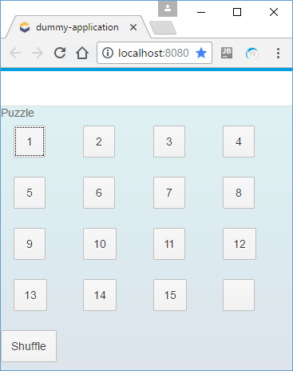
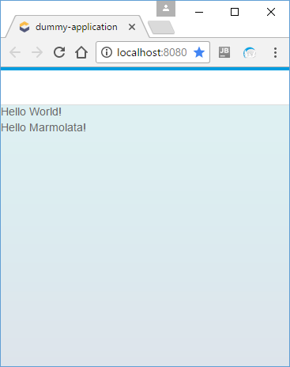
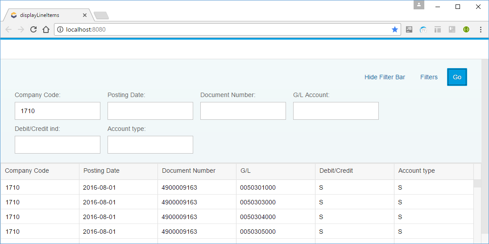

# HPI 2017

## Presentation material

- [Scala 01](https://hpiscala.github.io/2017/?md=scala_01#1)
- [Scala 02](https://hpiscala.github.io/2017/?md=scala_02#1)
- [Marmolata intro](https://hpiscala.github.io/2017/?md=marmolata_01#1)
- [Marmolata UI](https://hpiscala.github.io/2017/?md=marmolata_ui#1)
- [Marmolata Data](https://hpiscala.github.io/2017/?md=marmolata_data#1)

## Student assignments

- [1 - Call center app](assignment_01.md)

## Sandbox environments

### UI sandbox

A minimal sandbox environment to play around with UI code.

Prerequisites:
- [Chrome driver](https://sites.google.com/a/chromium.org/chromedriver/downloads)
  - copy the extracted driver file (chromedriver[.exe]) to the ***sandbox/ui*** directory

How to use:
- Start the sandbox

```bash
$ cd sandbox/ui
$ make run

```

- Change code in file ***sandbox/ui/js/src/main/scala/Sandbox.scala***
- Upon saving changes, the code will be recompiled and run in a new Chrome window 

### Data sandbox

A minimal sandbox environment to play around with data code.

How to use:
- Start the sandbox

```bash
$ cd sandbox/data
$ make run

```

- Change code in file ***sandbox/data/dataSandbox/src/main/Sandbox.scala***
- Upon saving changes, the code will be recompiled, and you can see results in the console window 

## Template/example applications

### Puzzle 



A simple, ui-only puzzle application

```bash
$ cd templates/puzzle
$ make run

```

### UI with data template application



A template application with UI and data code:
- UI: hello world
- Data: simple server with configured DB access


```bash
$ cd templates/ui_with_data
$ make run

```


### A simple line item browser



A template application with UI and data code:
- UI: hello world
- Data: simple server with configured DB access


```bash
$ cd templates/line_item_browser
$ make run

```
