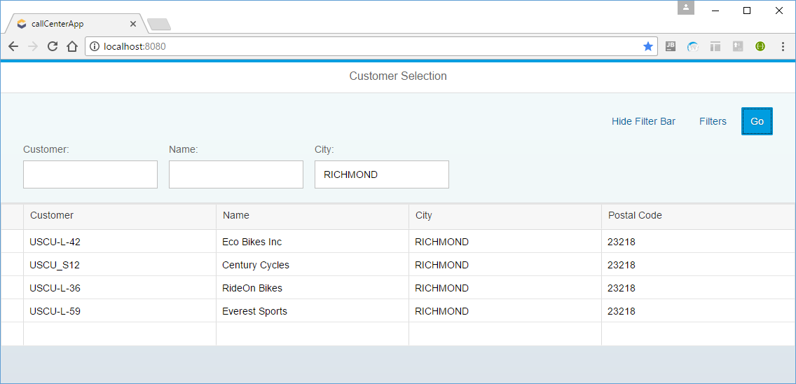
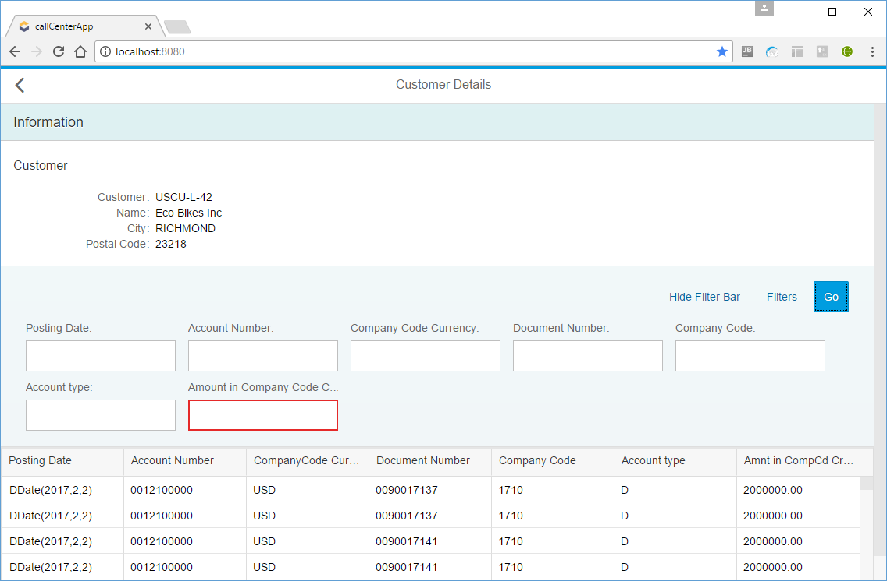

# Exercise 1

Scenario: your task is to develop an application for call center employees.

The application should load and display the below information about the customer in the call:
- master data (e.g. customer ID, name, city, postal code, etc.)
- line items belonging to the customer

## Task 1 - identify the customer (table ***KNA1***)

The call center employee should be able to find a customer by
- customer ID (***KUNNR***) 
- name (***NAME1***)
- city (***ORT01***)
- postal code (***PSTLZ***)

## Task 2 - display customer's master data and line items

Once the customer is identified, the call center employee should her
- master data (table ***KNA1***)
  - customer ID  (***KUNNR***) 
  - name (***NAME1***)
  - city (***ORT01***)
  - postal code (***PSTLZ***)
  - (feel free to extend by further attributes)

- line items (table ***ACDOCA***)
  - posting date (***BUDAT***)
  - account number (***RACCT***)
  - company code currency (***RHCUR***)
  - document number (***BELNR***)
  - company code (***RBUKRS***)
  - account type (***KOART***)
  - amount in company code currency (***HSL***)

It should be possible to filter line items by all the displayed attributes

