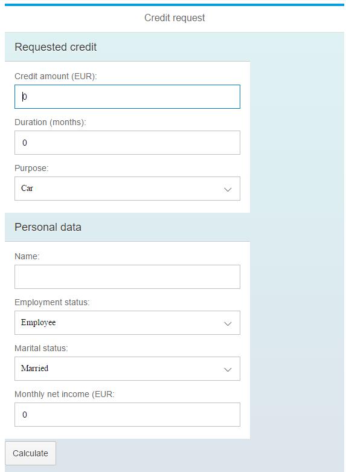
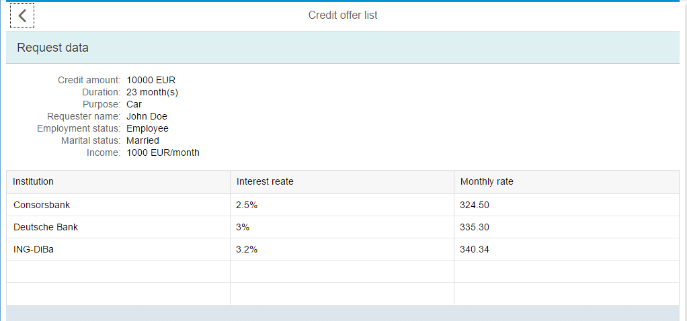

# Exercise 2

Scenario: your task is to develop a simple credit calculator application

The application's landing page should display a simplified preliminary credit request form, with at least the data below:
- Requested credit data
  - amount (*)
    - has to be a valid integer number
  - duration (months) (*)
    - has to be between 1-48 months
  - purpose 
    - (e.g. car, vacation, free purpose, marriage,etc)
- Credit requester data
  - name
  - employment status 
    - (e.g. employee, part-time employee, etc)
  - marital status  
    - (married, not married)
  - monthly net income (*)
    - has to be a valid integer number
    
    
    
## Task 1 

After filling in all the mandatory fields (marked with (\*) ) the ***Calculate*** button should become enabled.

## Task 2

Pressing the ***Calculate*** button initiates a server turnaround.

The backend service should
- *at least* take the amount, duration and income as input parameters
- perfom a credit check
  - rules to be determined by the teams
- return a list of credit offers (name of bank, interest rate, monthly rate)
  - an empty list means that the requester is not eligible for a credit
- no connection to database necessary

The 2nd page of the application should display all the credit request data as a readonly form, as well as the list of credit offers in a table.

By pressing the ***Back*** button the user should return to the inital page where he/she should be able to change the request data and retrigger calculation.

