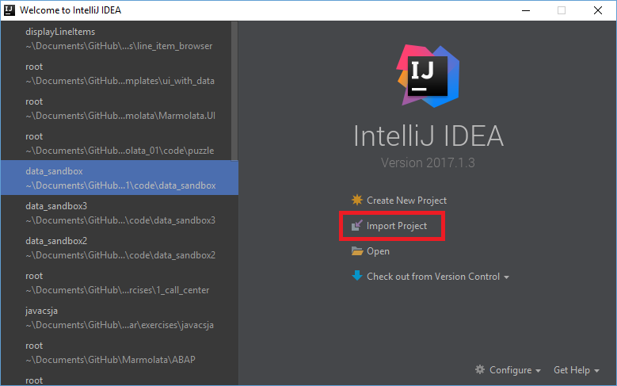
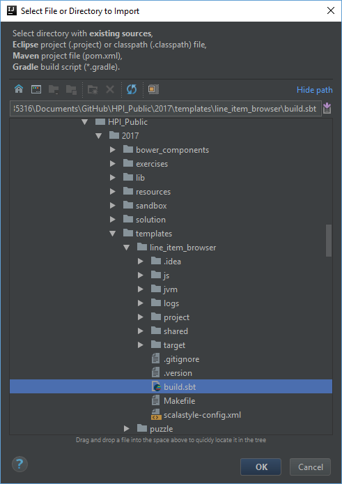
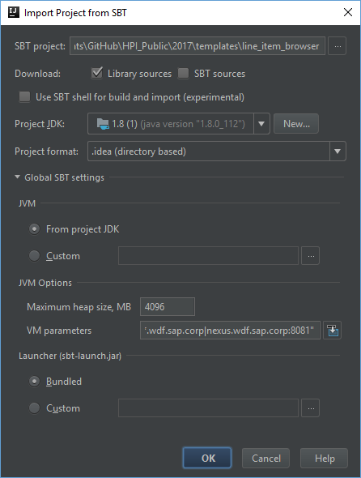
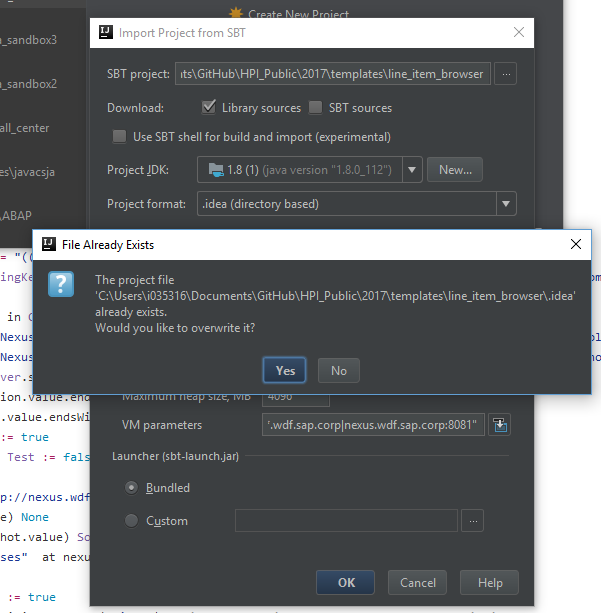
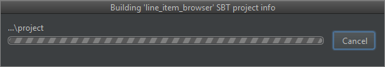
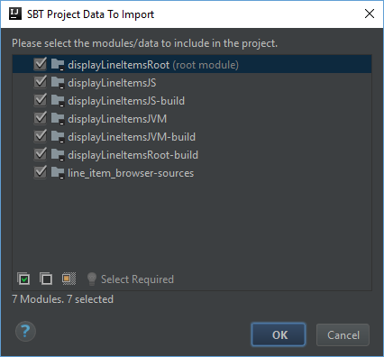
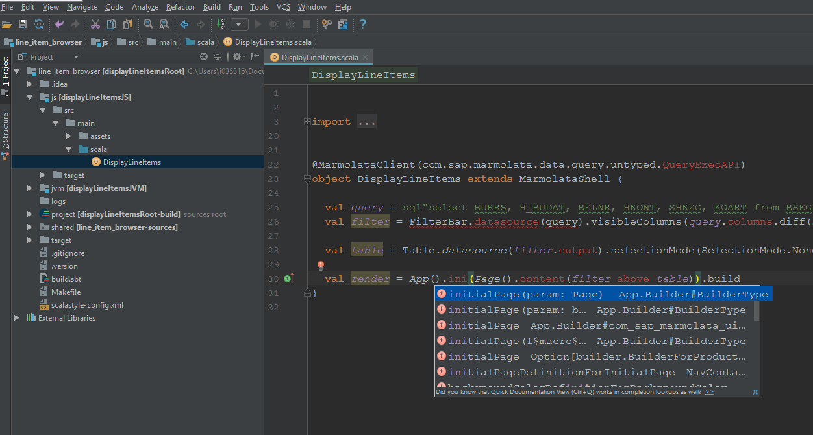

# IDE Import & Workflow tutorial

This tutorial explains step-by-step how to import a marmolata project into IntelliJ, and how to compile/run it.

## Importing the project

The project in ***templates/line_item_browser*** shall be used as example.

- Start the import project wizard in IntelliJ



- Select the project's ***build.sbt*** file



- Check SBT settings
  - the JDK has to be a recent 1.8 one
  - JVM heapsize 4096 or 8192 (if you have much RAM)
  - no need to change anything else, the defaults will work
  


- If you imported the project before, let it get overwritten



- SBT will start building the project info ...



- Import all the modules into the project (just press OK)



- And that's it



IntelliJ may start indexing, which takes a while, but after that code completion should work for most of the code, except for macro-generated artifacts like the `query`

Most parts of the code shall be marked red by IntelliJ, but that doesn't mean that it won't compile. 

## Proposed workflow

In order to speed up compile times we propose the below workflow:

* Open 2 terminal windows
* In Window 1 start the server

```shell
$ cd templates/line_item_browser
$ sbt displayLineItemsJVM/run

```

* In Window 2 start sbt, and trigger recompilation on file change

```shell
$ cd templates/line_item_browser
$ sbt
...
displayLineItems(master)> ~;fastOptJS;assets

```

Whenever you change code, sbt will recompile it and copy the UI artifacts to the directory from which the server is serving requests.
