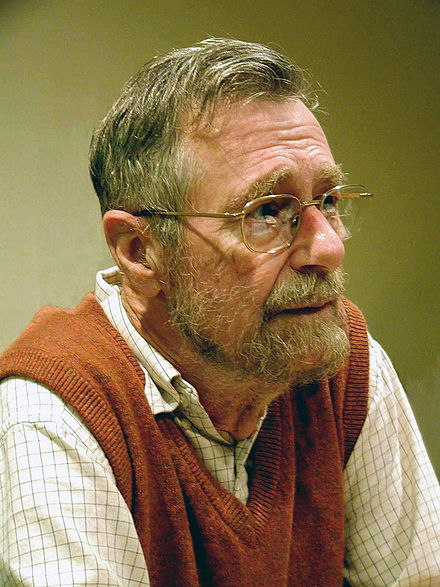

class: middle, center
# Scala Basics 1


Object-orientated meets Functional
---

## What is Scala?

- **Programming language** invented 2007 by **Martin Odersky** @ EPFL
<br/><br/>
--

- Can be compiled to:
  - **JVM** byte code
  - **JavaScript** code
  - **LLVM/native** code (experimental)
<br/><br/>
--

- **Fully compatible** to Java (Scala can use Java code and vice versa)
<br/><br/>
--

- Scala = Java **+** some features/concepts from **functional programming**
  - statically typed, with type inference
  - functions are **first-class citizens**, i.e., functions are ordinary objects
  - good support for **side-effect free** programming and **immutable data structures**
  - **pattern matching**
  - **type classes** (via implicits)
  - good support for **modular programming** (Scala stands for "Scalable Language")
  - use of `null` is discouraged (Tony Hoare: "I call it my billion-dollar mistake. It was the invention of the null reference in 1965.")
  - Good support for **modern forms of concurreny** and **distributed stuff**
  - Well-suited for **embedding DSLs** such as query languages etc.
<br/><br/>

---

## Lightweight Language

--
* **No return** statement needed and **no curly** braces needed for single line expressions

```Scala
  def inc(x: Int): Int = x + 1
```
--
* **Type inference** means types can often be omitted

```Scala
  val l1 = List(1, 2, 3)
  val l2 = l1.map(_ + 1)
  val l3 = l2.sum
```
--
* **Dots and parentheses** in method calls can often be left out

```Scala
  List(1, 2, 3) ++ List(4, 5, 6) // instead of List(1, 2, 3).++(List(4, 5, 6))
```
--
* **Semicolons** are **optional**

```Scala
  {
    val x = 5
    x + 1
  }
```

or 

```Scala
  {val x = 5; x + 1}
```

---

## FP vs. OOP

FP is often seen as a counter-model to **OOP** 

- Object-oriented programming - **encapsulate** state

- Functional programming      - **avoid** state 

---

## OOP 

<center></center>

--

- Alan Curtis Kay, California

--

- 2003 ACM **Turing Award** for work on **object-oriented programming**, Smalltalk 

--

- "The best way to predict the future is to invent it."

---

## OOP

<center></center>

--

- Edsger Wybe Dijkstra, 1930 - 2002, Netherlands

--

- 2003 ACM **Turing Award** for work on programming languages (**ALGOL**)

--

- "The major cause of the software crisis is that the machines have become several orders of magnitude more 
  powerful! To put it quite bluntly: as long as there were no machines, programming was no problem at all; 
  when we had a few weak computers, programming became a mild problem, and now we have gigantic computers, 
  programming has become an equally gigantic problem."

--

- "Pictures are for weak minds."
--

- "Object-oriented programming is an exceptionally bad idea which could only have
  originated in California."

---

## OOP

> "I don't know how many of you have ever met Dijkstra, but you probably know
> that arrogance in computer science is measured in nano-Dijkstras."

(Alan Kay)

---

## OOP

<center></center>

--

- Joe Armstrong, 1950, UK

--

- Inventor of Erlang

--

- "I think the lack of reusability comes in object-oriented languages, not
  functional languages. Because the problem with object-oriented languages is
  they’ve got all this implicit environment that they carry around with them.
  You wanted a banana but what you got was a gorilla holding the banana and the
  entire jungle."

---

## OOP meets FP

<center></center>

--

- Martin Odersky, EPFL

--

- Inventor of Scala

--

- Co-designer of Java generics

--

- Original author of the current javac reference compiler

---

- From "A Brief, Incomplete, and Mostly Wrong History of Programming Languages"

> "2003 - A drunken Martin Odersky sees a Reese's Peanut Butter Cup ad 
> featuring somebody's peanut butter getting on somebody else's 
> chocolate and has an idea. 
> He creates Scala, 
> a language that unifies constructs from both object oriented and functional languages. 
> This pisses off both groups and each promptly declares jihad."

---

## The Scala REPL and sbt

- Scala comes with a **REPL** (Read-Evaluate-Print-Loop) 

  ```Bash
  $ scala
  Welcome to Scala version 2.11.7 (Java HotSpot(TM) 64-Bit Server VM, Java 1.8.0_92).
  Type in expressions to have them evaluated.
  Type :help for more information.

  scala> 
  ```

  You can exit the REPL with `Ctrl`-`D`

--

- Scala files end with `.scala`

  ```Bash
  $ echo "object MyObj {def main(args: Array[String]): Unit = print(\"\nHello\n\n\")}" > test.scala
  ```

--

- The standard **build tool** is `sbt`:
  - `sbt compile` compiles your project
  - `sbt run` runs (and if necessary compiles) your project
  - `sbt console` opens a REPL for your project

--

- Complete example:

  ```Bash
  $ echo "object MyObj {def main(args: Array[String]): Unit = print(\"\nHello\n\n\")}" > test.scala
  $ sbt run 

  ```


---

## Evaluating expressions

The REPL can be used to **evaluate expressions**:

```Scala
scala> 3 + 4
res0: Int = 7
```
--

```Scala
scala> "Hallo" + " " + "SAP!"
res1: String = Hallo SAP!
```

--

```Scala
scala> (42: Int).toString
res0: String = 42
```

--

<br/>
- Types are **inferred** (local type inference), but can be annotated
<br/><br/>
- **Every value** is an **object** and thus potentially has methods.

---

## Values

Values can be **bound to names** as follows:

```Scala
scala> val delta = 42
delta: Int = 42
```

- The name `delta` now denotes the value `42`.
- **Important:** `delta` is a value and not a variable, i.e., the value that is denoted by `delta` cannot be changed.
- Values in Scala are similar to a **final definitions** in Java.

--

## Variables
```Scala
scala> var delta = 42
delta: Int = 42

scala> delta = 0
delta: Int = 0

scala> delta
res10: Int = 0
```
---

## Functions

Functions are **first-class citizens**.

```Scala
scala> {x: Int => x + 1}
res2: Int => Int = <function1>
```

--

Functions can be **applied** as follows:

```Scala
scala> ({x: Int => x + 1})(3 + 4)
res3: Int = 8
```

```Scala
scala> val delta = 42
delta: Int = 42
scala> val incByDelta = {x: Int => x + delta}
incByDelta: Int => Int = <function1>
scala> incByDelta(1)
res6: Int = 43
scala> val delta = 0
delta: Int = 0
scala> incByDelta(1)
res7: Int = 43
```

--

Functions can be **partially applied**:

```Scala
scala> val f = {x: Int => y: Int => x + y}
f: Int => (Int => Int) = <function1>

scala> val g = f(1)
g: Int => Int = <function1>

scala> g(2)
res0: Int = 3
```

---

## Methods vs Functions

- Methods are defined using `def`, and are slightly different from functions
- However, in many cases methods and functions can be used interchangeably

```Scala
scala> val delta = 42
delta: Int = 42

scala> def incByDelta(x: Int) = x + delta
incByDelta: (x: Int)Int

scala> incByDelta(_)
res0: Int => Int = <function1>

scala> incByDelta(1)
res0: Int = 43
```
---

## Higher-order Functions

Functions that **take functions as arguments** or **return functions**

```Scala
scala> def applTwice(f: Int => Int, x: Int) = f(f(x))
applTwice: (f: Int => Int, x: Int)Int

scala> applTwice(incByDelta, 1)
res1: Int = 85


scala> def incBy(num: Int): Int => Int = (v: Int) => v + num
incBy: (num: Int)Int => Int

scala> val add2 = incBy(2)
add2: Int => Int = <function1>

scala> add2(12)
res0: Int = 14

```
---

## Parametric polymorphism

Methods, classes, and traits can be **polymorphic**.

--

**Parametric polymorphism** means that there can be a **type parameter**.

```Scala
scala> def applTwice[T](f: T => T, x: T) = f(f(x))
applTwice: [T](f: T => T, x: T)T

scala> applTwice[Int](incByDelta, 5)
res3: Int = 89

scala> applTwice(incByDelta, 5)
res4: Int = 89

scala> applTwice({x: String => x + "!"}, "Hallo")
res6: String = Hallo!!
```
---

## Immutable data structures

Scala's standard library contains many **immutable data structures**, i.e., data structures that cannot be mutated after creation.

```Scala
scala> import scala.collection.immutable._
import scala.collection.immutable._
scala> val intLst = List(1, 2, 3, 4, 5)
intList: List[Int] = List(1, 2, 3, 4, 5)
scala> intList.length
res26: Int = 5
scala> val newIntList = 0 +: intList
newIntList: List[Int] = List(0, 1, 2, 3, 4, 5)
scala> intList.contains(0)
res22: Boolean = false
scala> newIntList.contains(0)
res23: Boolean = true
scala> intList.head
res24: Int = 1
scala> intList.tail
res25: List[Int] = List(2, 3, 4, 5)
scala> val sqList = intList.map({x: Int => x * x})
sqList: List[Int] = List(1, 4, 9, 16, 25)
```

- It is easy to reason about immutable data structures

- Beneficial for concurrency


---

## Traits and classes

```Scala
scala> trait Person {def name: String}
defined trait Person

scala> class Student(val studentId: Int, val name: String) extends Person

scala> val thomas = new Student(5, "Thomas")
thomas: Student = Student@de3a06f
```

--

## Case classes

```Scala
case class Student(name: String, passed: Boolean) extends Person

scala> val john: Person = Student("John", true)
john: Person = Student("John", true)

scala> john.name
res0: String = John
```

- case classes don't require `new` (companion object with `apply method`)
- case classes come with `equals`, `hashCode`, and `copy` methods
- case classes are automatically enabled for pattern matching (`unapply` method in companion object)

---

## Algebraic Data Types (ADTs)

* We can define **trees** in `tree.scala`:

```Scala
package object tree {
  sealed trait Tree[T]

  case class LeafNode[T](info: T) extends Tree[T]

  case class InnerNode[T](left: Tree[T], info: T, right: Tree[T])
    extends Tree[T]
}
```

* After typing `sbt console`, we can create `Tree`s:

```Scala
scala> import tree._
import tree._

scala> val t = InnerNode(LeafNode(3), 5, LeafNode(7))
t: tree.InnerNode[Int] = InnerNode(LeafNode(3),5,LeafNode(7))
```
---

## ADTs and pattern matching

* Most methods on ADTs are implemented via pattern matching on the structure
* We can define a function `count`:

```Scala
  def count[T](tree: Tree[T]): Int =
    tree match {
      case LeafNode(_)               => 1
      case InnerNode(left, _, right) => 1 + count(left) + count(right)
    }
```

* Test the code in `sbt console`

```Scala
scala> import tree._
import tree._
scala> val t = InnerNode(LeafNode(3), 5, LeafNode(7))
t: tree.InnerNode[Int] = InnerNode(LeafNode(3),5,LeafNode(7))
scala> count(t)
res0: Int = 3
```

---

## Exercises

Implement the following functions (open file [scala_01/exercises.scala](scala_01/exercises.scala)):

```Scala
package object tree {
  trait Tree[T]
  case class LeafNode[T](info: T) extends Tree[T]
  case class InnerNode[T](left: Tree[T], info: T, right: Tree[T])
                                                    extends Tree[T]

  def count[T](tree: Tree[T]): Int = tree match {
    case LeafNode(_)        => 1
    case InnerNode(l, _, r) => 1 + count(l) + count(r)
  }

  def height[T](tree: Tree[T]): Int =
    ???

  def sum(tree: Tree[Int]): Int =
    ???

  def map[A, B](f: A => B)(tree: Tree[A]): Tree[B] =
    ???

  import scala.collection.immutable._
  def toList[T](tree: Tree[T]): List[T] =
    ???

  def fold[A, T](f: (A, T) => A)(startValue: A)(tree: Tree[T]): A =
    ???
}
```

