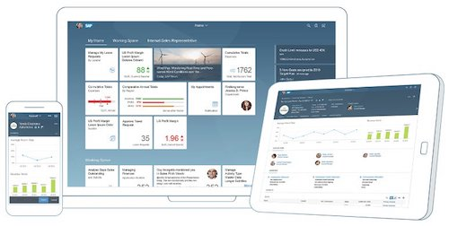

class: middle, center

<link rel="stylesheet" href="./styles/image.css">


# Marmolata

A Scala-based Enterprise Application Development Stack for the<br>SAP Cloud Platform

---
## What is the Marmolata Stack?

The Marmolata stack is a cloud-focused, **application development stack** used for building, running, and maintaining enterprise-ready applications that:
  - need to be highly scalable and fault-tolerant
  - require smooth integration into the SAP technology landscape

--

Marmolata is build in Scala and is delivered as a set of libraries.

---

## Why Scala? 1/4

The Scala language is both statically and strongly typed.  Therefore, errors are caught very early in the development process - almost always at compile-time.

--

For instance, if you *accidentally* pass a value of the wrong data type to a Scala function, you will discover this error at compile-time, not runtime.

In the example below, we are erroneously trying to find the absolute value of a character string...

```scala
scala> Math.abs("ff")
<console>:12: error: overloaded method value abs with alternatives:
  (x$1: Double)Double <and>
  (x$1: Float)Float <and>
  (x$1: Long)Long <and>
  (x$1: Int)Int
 cannot be applied to (String)
       Math.abs("ff")
            ^
```

As the error message above indicates, this code won't even compile.  This in turn, makes complex projects easier to maintain.

---
## Why Scala? 2/4

By comparing the same piece of code written in Java and Scala...

```java
//Java - we want to make a rocket launchable
interface Spacecraft { void launch(); }
class Rocket {
  String name;
  Rocket(String name) { this.name = name; } 
  void blastOff() { System.out.println("Rocket " + name + " blasted off"); }
}
class RocketAdapter implements Spacecraft {
  private Rocket r;
  RocketAdapter(Rocket r) { this.r = r; }
  public void launch() { r.blastOff(); }
}
public class Main {
  public static void main(String[] args) {
    new RocketAdapter(new Rocket("Bob")).launch();
  }
}
```

--

We find that Scala is both more concise and expressive.

```scala
//Scala - we want to make a rocket launchable
case class Rocket(name: String) {
  def blastOff: Unit = { System.out.println(s"Rocket $name blasted off") }
}
implicit class RocketCanBeLaunched(r: Rocket) {
  def launch: Unit = { r.blastOff }
}
object Main {
  def main(args: Array[String]): Unit = { Rocket("Bob").launch }
}
```

---
## Why Scala? 3/4

Scala has features that allow problem domain gurus to write units of code such as macros and type classes.  Such units of code then make work of mainstream developers significantly less complex.

```scala
import java.util.Date

import scala.reflect.macros.blackbox.Context
import scala.language.experimental.macros

object LibraryMacros {
  def greeting: String = macro greetingMacro

  def greetingMacro(c: Context): c.Tree = {
    import c.universe._

    q""" "Hi! This code was compiled at " + ${new Data().toString} """
  }
}

object HelloMacros extends App {
  import LibraryMacros._

  // "greeting" is a macro that that prints "Hi!" followed by the time when the macro ran. 
  // Since macros run at compile-time, this is the time the code was compiled.
  println(greeting)
}
```

---
## Why Scala? 4/4
Scala is well-suited for the creation of Domain Specific Languages (DSLs)

For instance, in Marmolata, we provide a macro called `sql`:

```Scala
sql"select SUM(HSL) from ACDOCA where BUKRS=${companyCode}"
```

At compile time, the `sql` macro will generate all the necessary boiler-plate code needed to perform a SQL query against some backend database.

--

We also have simple DSLs for specifying the layout of UI elements: 

```scala
val vertical = input above button above table
```

Where `input`, `button` and `table` are UI elements.


---

## Marmolata's Value Proposition 1/2

In simple terms - Write Less, Get More.

Using the Marmolata stack, an application developer...

  - ...is now free to focus on solving the business problem, instead of being distracted by the mechanics backend communication  
--

  - ...needs to write far fewer lines of code to achieve the required business result and can consequently develop robust applications in a shorter space of time  
--

  - ...can make use of abstractions tailored to their business needs  
--
  
  - ...works with coding that is easy to maintain thanks to Scala's type and module system  
--

  - ...can write both the client-side and server-side parts of their application in the same language (thanks to `Scala.js` that compiles Scala into JavaScript)

--

In addition to these benefits, compile-time optimisation and specialisation is performed that results in high performance applications.

"Whole program" optimisation is also possible for the frontend part of applications.


---
## Marmolata's Value Proposition 2/2

Marmolata provides a seamless interaction with not only ABAP-based systems, but also Ariba, Concur and  SuccessFactors systems.



Whilst Marmolata can be used with any JavaScript-based UI technology, its primary user interface is built on SAPUI5, and is therefore consistent with the Fiori design principles.
<br><br><br><br>

--

Marmolata also provides a flexible deployment model. Build your application once and then deploy it either to:

  - An on-premise (SAP HANA XSA) system, or
  - The SAP Cloud Platform

---

## Example: A Simple Line Item Browser
The following few lines of Scala code use Marmolata to construct a filterable table showing the contents of database table `BSEG`:

```scala
@MarmolataClient(com.sap.marmolata.data.query.untyped.QueryExecAPI)
object DisplayLineItems extends MarmolataShell {

  val query = sql"select BUKRS, H_BUDAT, BELNR, HKONT, SHKZG, KOART from BSEG"
  val filter = FilterBar.datasource(query).build
  val table = Table.datasource(filter.output).selectionMode(SelectionMode.None).build
  
  val render = App().pages(Page().content(filter above table)).build
}
```
--
This simple program produces the following results in which the `filter` and `table` UI Elements are positioned as follows:  
&nbsp;&nbsp;&nbsp;&nbsp;&nbsp;&nbsp;&nbsp;&nbsp;&nbsp;&nbsp;&nbsp;&nbsp;&nbsp;&nbsp;&nbsp;&nbsp;&nbsp;&nbsp;&nbsp;&nbsp;&nbsp;&nbsp;&nbsp;&nbsp;&nbsp;&nbsp;&nbsp;&nbsp;&nbsp;&nbsp;&nbsp;`filter` &nbsp;&nbsp;&nbsp;and &nbsp;&nbsp;&nbsp;&nbsp;&nbsp;&nbsp;&nbsp;&nbsp;&nbsp;&nbsp;&nbsp;&nbsp;&nbsp;`table`

 

---

## Runtime Architecture  

A Marmolata application consits of two parts
- frontend: executed on the web browser
- app-specific backend: executed on a JVM on the server
- services: executed on a JVOM on the server


---

## Runtime Architecture  

A Marmolata application consits of two parts
- frontend: executed on the web browser
- app-specific backend: executed on a JVM on the server
- services: executed on a JVOM on the server


---

## Runtime Architecture  

A Marmolata application consits of two parts
- frontend: executed on the web browser
- app-specific backend: executed on a JVM on the server
- services: executed on a JVOM on the server


---

## Runtime Architecture  

A Marmolata application consits of two parts
- frontend: executed on the web browser
- app-specific backend: executed on a JVM on the server
- services: executed on a JVOM on the server


---

## Runtime Architecture  

A Marmolata application consits of two parts
- frontend: executed on the web browser
- app-specific backend: executed on a JVM on the server
- services: executed on a JVOM on the server


---

## Runtime Architecture - Summary

The Client/Web-Browser (A) and App-specific Marmolata Scala backend (B) are connected by a private channel (1).

The backend (B) may use
  * HANA DB via (5) 
  * standalone (Marmolata) services (C) via (2) 
  * ABAB stack via (4)


Non-Marmolata clients may connect to Marmolata services via open protocols (3) using a RESTful approach.

This is supported by various technology stacks such as AngularJS, UI5, or native mobile.

---

## Compilation

- **Server code** is compiled into **JVM** byte-code
- **Client code** is compiled to **JavaScript** and executed in a **Web browser**
- **Shared code** is compiled into **both** **JVM** byte-code and **JavaScript** 
  - E.G.: Business logic such as validators can be used on both the client and the server 
- **Metadata and configurations** are loaded and transformed at compilation time


---

## Getting started?

To build a **toy web application**, do the following:

1. Clone the following repository and change to directory `templates/ui_with_data`

    ```bash
    git clone https://github.wdf.sap.corp/Marmolata/Marmolata.ApplicationTemplate.git
    cd templates/ui_with_data
    ```
--

2. We get:

    ```
    .
    ├── Makefile
    ├── build.sbt
    ├── js
    │   └── src
    │       ├── main
    │       │   └── scala
    │       │       └── HelloWorldApp.scala
    │       └── ... 
    ├── jvm
    │   └── src
    │       └── main
    │           └── scala
    │               └── HttpServerMain.scala
    ...
    ```
--

3. The app is started by typing `sbt fastOptJS ~mainJVM/run`

---

## Creating a Client-side App

The following Scala code is compiled into JavaScript and executed in the browser:

```scala
import com.sap.marmolata.app.MarmolataClient
import com.sap.marmolata.app.client.MarmolataShell
import com.sap.marmolata.ui.{App, Label, Page}
import com.sap.marmolata.ui.implicits._


@MarmolataClient
object HelloWorldApp extends MarmolataShell {
  val label = Label("Hello World").build 
  val label2 = Label("Hello Marmolata").build
  val render = 
    App().pages(
      Page().content(label above label2)
    ).build() 
}
```
--

* `@MarmolataClient` is a macro that provides server connectivity  
--

* The value `render` defines the application's appearance  
--

* Every application consists of `pages` in which each `Page` has `content`  
--

* `content` is a sequence of `Control`s  
--

* Usually, there will be exactly one control for each page (which is typically a layout)  

---
## Creating a Server-side App

The following Scala code is compiled into JVM byte-code and executed on the server: 

```scala
import com.sap.marmolata.app.MarmolataServer
import com.sap.marmolata.app.server.backend.StandaloneBackend

@MarmolataServer
object HttpServerMain extends StandaloneBackend
```

In this example, the code simply defines an HTTP server that does nothing more than serve static HTML content (the frontend part of the app)

---

## More examples

There are more examples on the home page.

---

## Marmolata libraries:
- `Marmolata.App`  
  - The top-level library that includes all Marmolata functionality
  - Used when writing applications that contain both client- and server-side components  
  &nbsp;
--

- `Marmolata.UI`  
  - UI components based on SAPUI5
  - A subset of them make use of metadata (E.G. filter bar with value helps)  
  &nbsp;
--

- `Marmolata.React`  
  - A library for Function Reactive Programming (FRP)
  - Provides `Signal`s and `Event`s  
  &nbsp;
--

- `Marmolata.Data`  
  - Provides a means for type-safe data access 
  - Unifies access to a HANA system, OData endpoints, etc.  
  &nbsp;

---

class: middle, center
## Functional Reactive Programming with Marmolata.React


