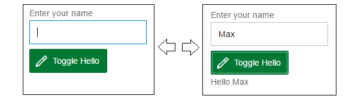
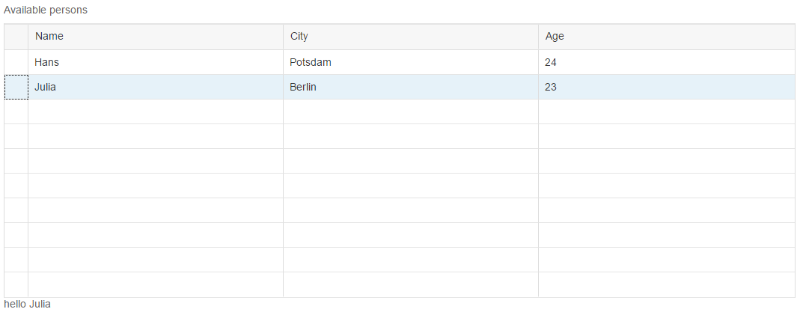
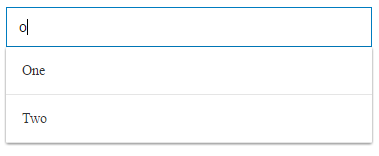
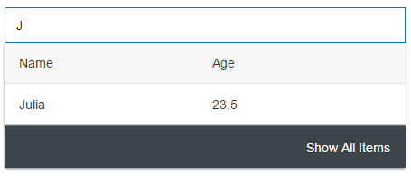

class: middle, center

# Introduction to the `Marmolata.UI` 

## Using Functional Reactive Programming for Building User Interfaces

---
## High-level Overview

The Marmolata.UI framework
- provides Scala-binding for **SAP UI5**
- embraces **functional reactive programming** 
- uses **builder pattern** in order to simplify control instantiation
- may be used 
  - purely or
  - in combination with `Marmolata.Data` to bind controls to data (e.g., from HANA) 

---
## UI Sandbox
- We provide a UI sandbox project to make it simple to play around with the UI library 
- Usage
  - git clone https://github.wdf.sap.corp/Marmolata/Marmolata.ApplicationTemplate.git
  - cd into the *sandbox/ui* directory
  - download and copy here the [Chrome Web Driver][http://chromedriver.storage.googleapis.com/index.html] 
  - start sbt: `> sbt`
  - start the sandbox: `~uiSandbox/run`
  - edit the *Sandbox.scala* file
    - upon saving it, it will be compiled automatically, and in case of success a new instance of Chrome will start where you can check what your code does

---
## Builders

- Controls are not constructed directly via constructors but via builders, e.g.,
  
  `Button()`

  is not of type `Button`, but of type `Button.Builder <: Builder {type Product = Button}`, with 

  ```Scala
  trait Builder {
      type Product
      def build: Product
  }
  ```

  ```Scala
  object Button {
      def apply(): Builder = Builder()
    
      @AbstractBuilder @Final // own macros; generate companion object Builder with apply() method
      trait Builder extends Builder {
        type Product = Button
        /* 
         * Marcro @Prop() adds 
         *   def text(x: Signal[String])
         *   def text(x: String)
         */
        @Prop("") def text: Signal[String]
        ...
        def build(): Button = new UI5Impl(this)
      }
  
      private class UI5Impl(builder: Builder) extends Control.UI5Impl(builder) with Button { ... }
  }
  ```

---

## Builders (cont.)

We may construct a button as follows:

```Scala
// creates a builder for a button
val buttonBuilder   : Button.Builder = Button()
// we do a functional update, i.e.,
// we creates a new builder that is like the old builder, but now builds OK buttons.
val okButtonBuilder : Button.Builder = buttonBuilder.text("OK") 
// Finally, we use the build method of the builder to build a button
val okButton        : Button         = okButtonBuilder.build
```

Most of the times we will write it like this:

```Scala
val okButton = Button().text("OK").build()
```

A builder is something that offers a method `build` to build products. 
Addidionally it provides methods to perform a functional update.

---

### Excursus: Functional update vs. normal update

Normal update:

```Scala
  case class Pair[L, R](var l: L, var r: R)

  val x = Pair("Yo", 42)

  x.l = "Test"
```

Functional update:

```Scala
  case class Pair[+L, +R](l: L, r: R) {
    def l[V](v: V): Pair[V, R] = Pair[V, R](v, r)
    def r[V](v: V): Pair[L, V] = Pair[L, V](l, v)
  }

  val x  : Pair[String, Int   ] = Pair("Yo", 42)

  val x2 : Pair[String, Int   ] = x.l("Hello")

  val x3 : Pair[String, String] = x.r("world")
```

---

## Builders (cont.) - Why?

### Constructors with many parameters

#### Problem 1: Toxic combination of implicits and overloading

In the first iteration, we had constructors with a lot of parameters, e.g., 

```Scala
  class Button(val text: Signal[String] = "", val enabled: Signal[Boolean] = true, ...)  
```

However, we also wanted to give the user the option to pass a value of type `X` whenever a value of type 
`Signal[X]` is required.  We first tried to solve this via implicits.  Lessons learnt: Be careful with implicits.

#### Problem 2: Instantiating a control by specifying all properties is tedious, and hinders reuse
```scala
val btn = Button(type=ButtonType.Accept, text="Ok", enabled=true, icon=Icon.Uri.save)
val btn2 = Button(type=ButtonType.Accept, text="Accept", enabled=true, icon=Icon.Uri.save)
```

The same with builders

```scala
val btn = Button().buttonType(ButtonType.Accept).text("Ok").enabled(true).icon(Icon.Uri.save)
val btn2 = btn.text("Accept") //only overriding the text
val btnControl = btn.build() //building the actual control
```

- each builder function call (like *enabled*) returns a new builder
- control is instantiated by calling *build* on the builder
  - the framework takes care of this in most of the cases via implicit conversion
---
## Simple example
- Build a simple example using the below elements:
  - Label
  - InputField
  - Button
- There should be an input field for entering a person's name with its corresponding label
- There should be a "Toggle hello" button, which shows/hides a label with a greeting message
- Greeting message has to be specific for the name entered in the input field



---
## Simple example - using Signals/Vars
- We'll need a dynamic value that changes upon each button click
- That's called a time-varying value in the FRP jargon, ie a *Signal*, which
  - is a container - may hold a value of any type
  - has an actual value, accessible by calling the *now* method
  - is *Observable*, ie providing means to react on value changes

- But it has no method for actually changing the value, so we need a *Var*, which is 
  - a *Signal* (so has the *now* method)
  - and whose value can (only) be changed by calling its *update* method 
    - or its infix alias *:=*

```scala  
//declaring a Var
val visible: Var[Boolean] = Var(false)
//changing the value
visible := !visible.now
// or
visible.update(!visible.now)

//doing something when value has changed
val observer = visible.observe( b => println(s"New value: $b") )

//killing the observer
observer.kill()
```

---

## Simple example - reacting on events

- We need to take care of the button clicks, so we need to handle events
- *Event* 
  - is an *Observable* (similarly to *Signal*)
  - may carry a value

```scala
//the Button pusblishes click events
btn.clicks.observe( _ => {
  visible := !visible.now
})

```

---
## Simple example - dynamic label

- Finally we need a Label with dynamic text, which gets hidden/displayed when the button is clicked
- *Signals* and *Vars* can be used directly or transformed as needed

```scala
val helloLabel = Label(
  input.value.map(v => s"Hello ${v}")).
  visible(visible).build

```
- the label's text will always reflect the input field's content (*value* is a *Signal*)
- the label will be hidden unless the *Var* *visible* is *true*
---

## Simple example - put together

**This code may be tried out in the UI sandbox**

```scala
val visible: Var[Boolean] = Var(false)
val input = Input().initialValue("").build
val label = Label("Enter your name").labelFor(Some(input)).build
val btn = Button().buttonType(ButtonType.Accept).
  text("Toggle Hello").icon(Icon.Uri.edit).build

val helloLabel = Label(
  input.value.map(v => s"Hello ${v}")).
  visible(visible).build

btn.clicks.observe( _ => {
  visible := !visible.now
})

render(label above input above btn above helloLabel)
```

---
## Using tables
- In order to create a minimal standard table, you need to provide
  - a row type (ie a type representing a row in the table)
  - column configuration (name of the column, how to get it's value from the row, etc)
  - a content provider, which may be 
     - static: supplying the table with a predefined set of rows
     - custom: providing rows from a dynamic source, like a database query, web service call, etc.

- You may also customize the title, selection mode and various other table attributes
---
## Table example

**Goal:** 

- **Show a table** of a list of persons (name, city, age)
- Display a greeting message for the selected person 
  (single selection mode)

<center>

</center>

---
## Table example - code

**This code may be tried out in the UI sandbox**

```scala
    type Row = (String, String, Int)
    val input:Table[Row] =
      Table[Row]()
        .title(Label("Available persons").build)
        .visibleRowCountMode(VisibleRowCountMode.Fixed)
        .selectionMode(SelectionMode.Single)
        .columns(
          Column().headingWithLabel("Name").controlFromText((a: Row) => a._1).build,
          Column().headingWithLabel("City").controlFromText((a: Row) => a._2).build,
          Column().headingWithLabel("Age").controlFromText((a: Row) => a._3.toString).build
        )
        .content(StaticRowProvider(Seq(("Hans", "Potsdam", 24), ("Julia", "Berlin", 23)))).build()

    val helloLabel = Label(
      input.selectedRows.map(rows => {
        rows.headOption.map(row => s"hello ${row._1}").getOrElse("")
      })).build

    render(input.asBuilder above helloLabel.asBuilder)
```

- Note the column definition, you need to
  - supply a heading (simple case: label with static text)
  - and a control to display the column's content (in this case a simple static text)

---
## Simple suggestion provider



**This code may be tried out in the UI sandbox**

```scala
val suggestionProvider = SimpleSuggestionProvider.static(
  SimpleSuggestion("One").build(),
  SimpleSuggestion("Two").build()
)

val input = Input().suggestionProvider(suggestionProvider)
render(input)

```

- simple suggestions consist of a list of values
  - static (like in the above example)
  - dynamic - coming e.g from a database table

---
## Tabular suggestion providers




**This code may be tried out in the UI sandbox**

```scala
val suggestionProvider = TabularSuggestionProvider.static(
  Seq(
    RowSuggestion()
      .value("Hans")
      .representation(Seq(
        Text().text("Hans").build(),
        Text().text("26").build()))
      .keywords(Set("Hans"))
      .build,
    RowSuggestion()
      .value("Julia")
      .representation(Seq(
        Text().text("Julia").build(),
        Text().text("23.5").build()))
      .keywords(Set("Julia", "Julika"))
      .build),
  Seq("Name", "Age")
)
val input = Input().suggestionProvider(suggestionProvider)
render(input)

```

---
## Layouts


**This code may be tried out in the UI sandbox**

```scala
val label1 = Label("Label 1")
val label2 = Label("Label 2")
val label3 = Label("Label 3")

val vertical = Vertical().content(label1, label2, label3)
val horizontal = Horizontal().content(label1, label2, label3)
val grid = Grid().content(
  label1.span(2),
  label2.span(2).indent(2),
  label1, label2, label3
)
render(grid)
```
---
