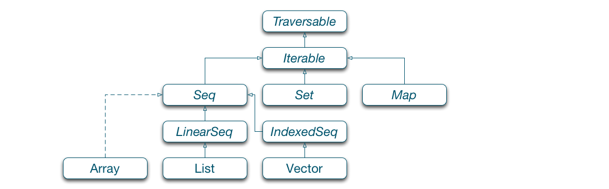
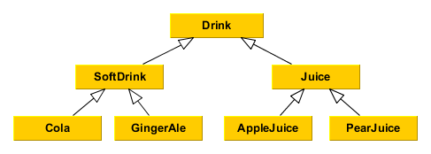

class: middle, center

# Scala Basics 2

Object-oriented meets Functional...again
---

## Object-Oriented Scala

* Interfaces for getting functionality via (single) inheritance
* Default constructor in classes

```Scala
class Calculator(brand: String) {
  val color = if (brand == "TI") {
    "blue"
  } else if (brand == "HP") {
    "black"
  } else {
    "white"
  }

  println("You can do this, too! This is executed as part of the constructor")
}

new Calculator("HP")
new Calculator("TI")
```
--

* Additional constructors for classes

```Scala
class Processor(dbConnection: java.sql.Connection, properties: Properties) {
  def this(dbConnection: java.sql.Connection) = {
    this(dbConnection, new Properties())
  }
}
```
---
## Object-Oriented Scala (2)

* Fields: immutable and mutable
```Scala
class ImportantMessage {
  val message = "Hello, world!"
  var name = None
}
```
--
* Class parameters are not fields! Make them to fields by prefixing with val or var
```Scala
class Processor(val dbConnection: java.sql.Connection, var properties: Properties)
```
--
* Traits for mixing in functionality
* Pure data classes are best expressed as case classes:
  * Simple construction without `new`
  * Pattern Matching
  * `hashCode`, `equals` and `toString` methods for free

```Scala
case class Student(name: String, birthday: Date, enrollment: Date) {
  def age(when: Date = new Date()): Int = ...
}
```
* Methods: Default and named arguments
* Access modifiers: `private`, `protected`, `private[this]`, `private[package.name]`

---

## Packages

* Same as in Java: `package com.sap.marmolata.training`
* Imports:
```Scala
import java.net.URL
import scala.concurrent._
import scala.concurrent.{Future, Promise}
import scala.util.matching.{Regex => RegularExpression}
```
* Imports can be scoped:
```scala
def match() = {
  import scala.util.matching.Regexg
  ...
}
```

* package object

```Scala
//in file org/foo/bar/package.scala
package org.foo
package object bar {
  def foobar(s: String): Unit
}

```
- import the package object: `import org.foo.bar._`
  - this imports `foobar()` into the current scope
---
## Objects and Companion Objects

- Scala does not have static methods in classes
- The same concept can be implemented using `object`, Scala's way to declare a singleton
--

```scala
object Util {
  //greatest common divisor
  def gcd(a: Int, b: Int): Int = {
    b match {
      case 0 => a
      case _ => gcd(b, a%b)
    }
  }
}
```
---

## Objects and Companion Objects (2)
- use cases:
  - class factories
  - util classes
  - applications
  - `apply` method can be used to add "constructors" to the companion object

--

```scala

class User(name: String, roles: Seq[Role])
object User {
  def apply(name: String): User = new User(name, getDefaultRoles())
}

object app {
  def main(args: array[string]) = {
    args.foreach(println)
  }
}
```

- there can be both a scala class and a scala object with the same name
  - the object is then called "companion object"
  - companion objects can access private members
---

## Core Scala types

- need to know them to write idiomatic Scala code
- enable functional way of handling exceptional cases:
  - values that may be present or not - *Option*
  - error handling - *Try*
- represent a value of one of two possible types - *Either*

---

## Option

Instead of Java *null* - remember the billion dollar mistake of Tony Hoare

Option[A] is either
- an instance of the `Some[A](value: A)` case class
- or the `None` object

Basic usage example

```scala
def toInt(str: String): Option[Int] = {
    if (str.trim.matches("^[+-]?\\d+$")) Some(str.toInt) else None
}
```

---

## Option (2)

Pattern matching

```scala
case class Car(make: String, color: Option[String])

val myCar = Car("Trabant", None)

val c =
  myCar.color match {
    case Some(c) => c
    case None => "undefined"
  }

println(s"My ${myCar.make} has color $c") //"My Trabant has color undefined"

```

--

Providing a default value

```scala
val c = myCar.color.getOrElse("undefined")
```

---
## util.Try

Scala supports try-catch blocks similarly to Java
- catch block uses a partial function to specify how to deal with exceptions
- note that by using Option in the below example we lose the root cause of the error (and so cannot provide a meaningful error message to the user)

```scala
def toInt(str: String): Option[Int] = {
    try {
        Some(Integer.parseInt(str.trim))
    } catch {
        case e: NumberFormatException => None
    }
}
```

--

Try[A] is either
- an instance of the `Success[A](value: A)` case class
- an instance of the `Failure[A](exception: Throwable)` case class

Basic usage example

```scala
import util.Try
def toInt(in: String): Try[Int] = Try(in.toInt)

toInt("22")  //Success(22)
toInt("-22d") //Failure(java.lang.NumberFormatException: For input string: "-22d")
```
---
## util.Either
Represents a value of one of two possible types (a disjoint union)

An instance of Either[A,B] is an instance of
- either `util.Left[A](value: A)`
- or `util.Right[B](value: B)`

--

Common uses
- as an alternative to *Option* for dealing with possibly missing values - in this usage, convention dictates that
  - *Left* has the same semantics as *None* and
  - *Right* takes the place of *Some*
- as an alternative solution to error handling - by convention
  - *Left* is used for failure and
  - *Right* is used for success

---

## Collections

* Scala has a very rich collection API
* Divided into immutable (default) and mutable



* Functional approach to deal with collections of data
* Creating collections:

```Scala
scala> val list = List(1, 2, 3, 4)
list: List[Int] = List(1, 2, 3, 4)

scala> val seq = Seq(1, 2, 3, 4)
seq: Seq[Int] = List(1, 2, 3, 4)

scala> val set = Set(1, "2", 'c')
set: scala.collection.immutable.Set[Any] = Set(1, 2, c)
```
---

## Collection API - functional combinators

- filter
  - retrieves elements of a collection where the supplied predicate function evaluates to true

```Scala

scala> List.range(0,50).filter(x => x < 25 && x % 2 == 1)
res: List[Int] = List(1, 3, 5, 7, 9, 11, 13, 15, 17, 19, 21, 23)

```

--

- find
  - returns the first element of a collection that matches a predicate function

```Scala

scala> List.range(0,50).find( _ > 6)
res: Option[Int] = Some(7)

```
--
- partition
  - splits a list based on where it falls with respect to a predicate function

```Scala

scala> List.range(0,10).partition( _ % 3 == 0)
res: (List[Int], List[Int]) = (List(0, 3, 6, 9),List(1, 2, 4, 5, 7, 8))

```
---
## Collection API - functional combinators (2)

- flatten
  - collapses one level of a nested structure

```Scala
scala> val nested = List(List.range(0,5), List.range(6,10))
nested: List[List[Int]] = List(List(0, 1, 2, 3, 4), List(6, 7, 8, 9))

scala> nested.flatten
res42: List[Int] = List(0, 1, 2, 3, 4, 6, 7, 8, 9)

scala> Some(Some(42)).flatten
res44: Option[Int] = Some(42)

```

--
- map
  - evaluates a function over each element in the collection, returning a collection with the same number of elements
  - works perfectly with Options, but pay attention to nesting as in the below example

```Scala
scala> List.range(0,10).map(_ * 2)
res47: List[Int] = List(0, 2, 4, 6, 8, 10, 12, 14, 16, 18)

scala> List("foo","bar","baz").find(_ matches "ba.*").map(_ * 2)
res64: Option[String] = Some(barbar)
scala> List("foo","bar","baz").find(_ matches "xy.*").map(_ * 2)
res65: Option[String] = None

scala> def toCar(str: String): Option[Car] = if (str == "Trabant") Some(Car("Trabant", None)) else None
toCar: (str: String)Option[Car]

scala> List("BMW","Trabant","Opel").find(_ matches ".*ba.*").map(toCar)
res69: Option[Option[Car]] = Some(Some(Car(Trabant,None)))

```
---
## Collection API - functional combinators (3)

- flatMap
  - combines map and flatten

```Scala
scala> val f = {v: Int => List(v-1, v, v+1)}
f: Int => List[Int] = <function1>

scala> f(3)
res71: List[Int] = List(2, 3, 4)

scala> List(2,4,6).map(f)
res72: List[List[Int]] = List(List(1, 2, 3), List(3, 4, 5), List(5, 6, 7))

scala> List(2,4,6) flatMap(f)
res73: List[Int] = List(1, 2, 3, 3, 4, 5, 5, 6, 7)

```
--

- flatMap and nested Options

```Scala
scala> val g = {x: Int => if (x % 2 == 0) Some(x) else None}
g: Int => Option[Int] = <function1>

scala> List(1,2,3).map(x => g(x))
res87: List[Option[Int]] = List(None, Some(2), None)

scala> List(1,2,3).flatMap(x => g(x))
res88: List[Int] = List(2)

```
---
## Collection API - functional combinators (4)
- fold

   Deals with two things: a combining function, and a data structure (typically a list of elements)  
   The fold then proceeds to combine elements of the data structure using the function in some systematic way

  - definition for List[A]: `def fold[A1 >: A](z: A1)(op: (A1, A1) ⇒ A1): A1`  
    - takes an associative binary operator **op**
    - and a neutral element **z** that must not change the result (eg.: 1 for multiplication) as it may be applied arbitrary number of times
    - returns the result of applying **op** between all the elements of the List and **z**, or **z** in case of an empty list
  - the order in wich **op** is applied on elements is unspecified (that's why **op** has to be associative)

```Scala
val findMax = (x: Int, y: Int) => { val m = x max y; println(s"cp $x, $y -> $m"); m } 
scala> List(1,2,3,4).par.fold(Int.MinValue)(findMax) //par returns parallel implementation of List
cp -2147483648, 1 -> 1
cp -2147483648, 2 -> 2
cp 1, 2 -> 2
cp -2147483648, 3 -> 3
cp 3, 4 -> 4
cp 2, 4 -> 4
res12: Int = 4
```

---
## Collection API - functional combinators (5)

- foldLeft
  - definition for List[A]: `def foldLeft[B](z: B)(op: (B, A) ⇒ B): B`  
    - takes a binary operator **op**, and a start value **z** 
    - returns the result of applying **op** on all the elements starting with **z** from left to right

```Scala
scala> List(1,2,3,4).par.foldLeft(Int.MinValue)(findMax) //par returns parallel implementation of List
cp -2147483648, 1 -> 1
cp 1, 2 -> 2
cp 2, 3 -> 3
cp 3, 4 -> 4
res13: Int = 4

```  
--
- foldRight
  - definition for List[A]: `foldRight[B](z: B)(op: (A, B) ⇒ B): B`  
    - takes a binary operator **op**, and a start value **z** 
    - returns the result of applying **op** on all the elements starting with **z** from right to left

```Scala
scala> List(1,2,3,4).par.foldRight(Int.MinValue)(findMax) //par returns parallel implementation of List
cp 4, -2147483648 -> 4
cp 3, 4 -> 4
cp 2, 4 -> 4
cp 1, 4 -> 4
res14: Int = 4
```
---
## Collection API - functional combinators (6)

- reduce, reduceLeft, reduceRight
  - work the same way as their fold counterparts, but without the neutral/initial element **z**
  - due to the absence of **z** they throw exception for an empty list
- reduceOption, reduceLeftOption, reduceRightOption
  - lifted versions of the reduce\* functions, ie. return *None* in case of empty list

```Scala
scala> List(1,2,3,4).par.reduce(findMax) //par returns parallel implementation of List
cp 1, 2 -> 2
cp 3, 4 -> 4
cp 2, 4 -> 4
res16: Int = 4

scala> List(1,2,3,4).par.reduceRightOption(findMax) //par returns parallel implementation of List
cp 3, 4 -> 4
cp 2, 4 -> 4
cp 1, 4 -> 4
res17: Option[Int] = Some(4)

scala> List().reduceLeftOption(findMax) 
res18: Option[Int] = None

```

---
## Covariance and Contravariance

* T <: U means "T is a sub-type of U" or "T has type U as upper bound" (everything that can be done with U can also be done with T)
* T >: U means "T is a super-type of U" or "T has type U as lower bound" (everything that can be done with T can also be done with U)
* Covariance: A <: B => Type[A] <: Type[B]
* Contravariance: A <: B => Type[B] <: Type[A]


<center></center>

```Scala
Glass[T]   // invariance
// Glass[Cola] has no relation to Glass[SoftDrink] (Glass is invariant because it's mutable)

Dispenser[+T] // covariance 
// Dispenser[AppleJuice] is a sub-type of Dispenser[Juice]

Function1[-T, +R] // contravariance (T: type of the parameter, R: return type)
// Function1[Juice, Unit] is a sub-type of Function[AppleJuice, Unit]
// so e.g. a function pasteur: Function1[Juice, Unit] can be applied both on AppleJuice or PearJuice
// with covariant typing we would have to provide a separate version of pasteur for Apple/PearJuice

```

---
## Covariance & Contravariance Example

- Remember
  - covariance: A <: B => Type[A] <: Type[B]
  - contravariance: A <: B => Type[B] <: Type[A]

```Scala
class Car(val color: String)
class OpelAstra(color: String) extends Car(color)
class SkodaOctavia(color: String) extends Car(color)

//List is covariant
scala> val l1: List[Car] = List(new OpelAstra("red"), new SkodaOctavia("green"))
l1: List[Car] = List(OpelAstra@7744195, SkodaOctavia@77f529a6)

scala> val l2: List[OpelAstra] = List(new OpelAstra("red"), new Car("green"))
<console>:13: error: type mismatch;
 found   : Car
 required: OpelAstra
       val l2: List[OpelAstra] = List(new OpelAstra("red"), new Car("green"))
                                                            ^
//Function arguments are contravariant
def getColor(c: Car) = c.color
scala> getColor(new SkodaOctavia("green"))
res4: String = green

```
---

## Error Handling

* Java uses exceptions for error handling, which are difficult to use consistently
  * Where do you handle errors?
  * How do you distinguish between programmer errors (bugs) and user errors (wrong input)?
* Scala wants you to handle errors more explicitly
  * But exceptions still work (also because of Java compatibilty)

---

## Error Handling Options

* Option[T]: either Some[T] or None
* Try[T]: either Success[T] or Failure[T]
* Either[E,T]: either Left[E] (failure) or Right[T] (success)
* All of those can be use with `match`, `map`, `flatMap`, etc.
* Errors are passed down to the caller

```Scala
def divide(dividend: String, divisor: String): Try[Int] = { 
  Try(dividend.toInt).flatMap(dd => {
    Try(divisor.toInt).flatMap(ds => {
      Try(dd/ds)
    })
  })  
}
scala> divide("4","2")
res6: scala.util.Try[Int] = Success(2)

scala> divide("4","0")
res7: scala.util.Try[Int] = Failure(java.lang.ArithmeticException: / by zero)

scala> divide("4","0x")
res8: scala.util.Try[Int] = Failure(java.lang.NumberFormatException: For input string: "0x")

scala> divide("4","0x").toOption
res9: Option[Int] = None

scala> divide("4","0x") orElse divide("4","2")
res10: scala.util.Try[Int] = Success(2)

```
---
## Error handling options (2)

- for comprehension can be used instead of flatMap

```Scala
def divide(dividend: String, divisor: String): Try[Int] = { 
  for {
    dd <- Try(dividend.toInt)
    ds <- Try(divisor.toInt)
    res <- Try(dd/ds)
  } yield(res)
}

scala> divide("10","5")
res11: scala.util.Try[Int] = Success(2)

scala> divide("10","2").get
res17: Int = 5

scala> divide("10","0").getOrElse(3)
res18: Int = 3

```
---
## Implicits
- implicit variable: a variable marked with the `implicit` modifier
- functions may have an implicit parameter list
- when calling a method with unspecified implicit parameters
  - implicit values *of the right type* within scope get substituted

```Scala
implicit val name = "Joe"
implicit val age = 42

def printAge(implicit name:String, age: Int) = s"$name is $age year(s) old"

scala> printAge("Ben",34)
res19: String = Ben is 34 year(s) old

scala> printAge
res20: String = Joe is 42 year(s) old

```
--
* beware, implicits are matched by type, name doesn't matter

```Scala
implicit val name = "Joe"
implicit val name2 = "Max"

scala> printAge
<console>:17: error: ambiguous implicit values:
 both value name of type => String
 and value name2 of type => String
 match expected type String
       printAge
       ^
```
---
## Implicits (2)
- Implicit classes
  - provide a way to add new behaviour to existing classes
  - have to be defined within a class, an object, or a package object
    - (not necessary in the REPL)

```Scala

implicit class StringEnhancements(str: String) {  
  def sayHello = s"Hello $str, have a nice day!"
}

scala> val joe = "Joe"
joe: String = Joe

scala> joe.sayHello
res22: String = Hello Joe, have a nice day!

```
---

## Type classes
- a type class *C* defines some behaviour in the form of operations
- a type *T* is member if type class *C* if it supports the operations of *C*
  - whether type *T* is a member of the type class *C* is not inherent in the type
  - any developer can declare that a type is a member of a type class simply by providing implementations of the operations the type must support
- if *T* is member of the type class *C*, functions that have constrained one or more of their parameters to be members of *C* can be called with arguments of type *T*

```Scala
object SampleTypeClass {
  //the type class
  trait CanSayHello[T] {
    def sayHello(x: T): String
  }

  //making some types member of the typeclass
  object CanSayHello {
    implicit object StringCanSayHello extends CanSayHello[String] {
      def sayHello(x: String) = s"Hello $x"
    }

    implicit object IntCanSayHello extends CanSayHello[Int] {
      def sayHello(x: Int) = s"Hello $x"
    }
  }
}
```
---
## Type classes (2)
- code against a type class - verbose way vs syntactic sugar
  - `def greet[T](x: T)(implicit evidence: CanSayHello[T]): Unit = println(evidence.sayHello(x))`
  - `def greet[T:CanSayHello](x: T): Unit = println(implicitly[CanSayHello[T]].sayHello(x))`

```Scala
object Greeter {
  import SampleTypeClass.CanSayHello

  def greet[T:CanSayHello](x: T): Unit = println(implicitly[CanSayHello[T]].sayHello(x))
}

import Greeter._

scala> val xs = List("Joe", "Barney")
xs: List[String] = List(Joe, Barney)

scala> xs.foreach {greet(_)}
Hello Joe
Hello Barney

scala> val ys = List(1,2)
ys: List[Int] = List(1, 2)

scala> ys.foreach {greet(_)}
Hello 1
Hello 2

//double is not a member of the CanSayHello typeclass
scala> val zs = List(1.0,2.0)
zs: List[Double] = List(1.0, 2.0)

scala> zs.foreach {greet(_)}
<console>:36: error: could not find implicit value for evidence parameter of type
 SampleTypeClass.CanSayHello[Double]
       zs.foreach {greet(_)}


```